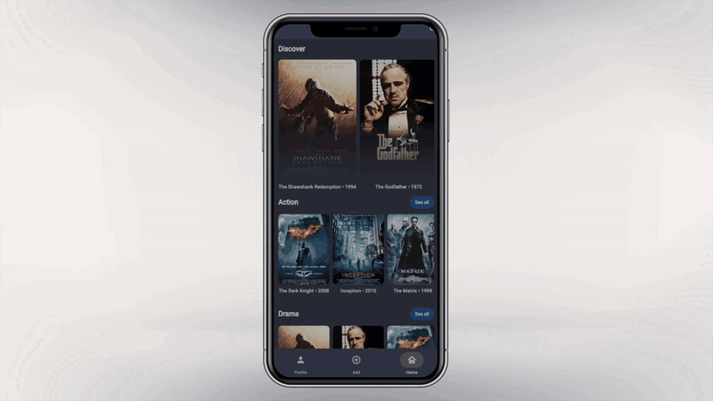
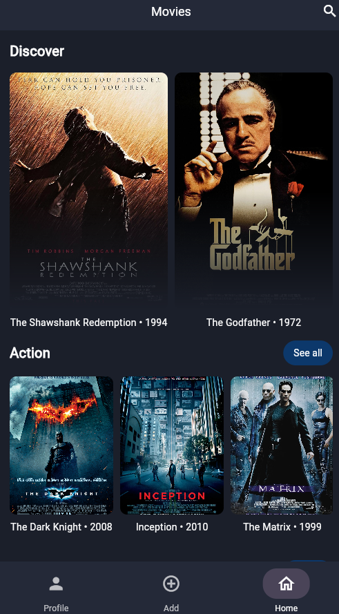
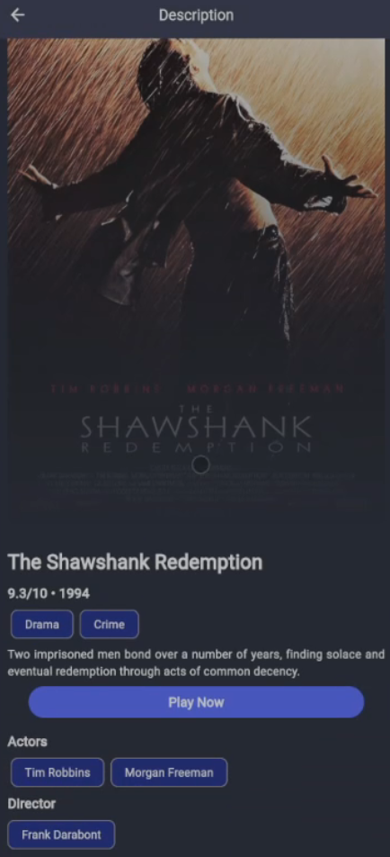

<div align="center">
    <h1>Movie App With Flutter</h1>
</div>

<<<<<<< HEAD

=======

<video src="assets/sample1.mp4" width="320" height="240" controls></video>

>>>>>>> 6ddd483beaf343ddaeaf4cabfab1c14d0bf577e9

         

This project is a **Movie App** built using Flutter as part of a university assignment. It allows users to browse movies and view details by reading data from a local MySQL database. The app provides a seamless experience by integrating a Flutter frontend with a Dart backend.

<div align="center"><h3>Features</h3></div><hr>

**Browse Movies:**

- - Discover movies stored in a local MySQL database.
- **Movie Details:**
  - View detailed information about movies, including description, rating, release date, and more.
- **Local Database Integration:**
  - Uses a MySQL database to fetch movie data dynamically.
- **Responsive UI:**
  - Optimized for both Android and iOS devices.

<div align="center"><h3>Tech Stack</h3></div><hr>



- **Frontend Framework:** Flutter
- **Backend:** Dart
- **Database:** MySQL
- **Database Connector:** mysql1 package
- **Routing:** shelf package
- **UI Design:** Material Design principles
- **Tools:** Dart, VS Code/Android Studio

<div align="center"><h3>Installation</h3></div><hr>

1. Clone the repository:
   
   ```bash
   git clone https://github.com/work-atrvoid/movie-app.git
   ```

2. Navigate to the project directory:
   
   ```bash
   cd movie-app/src
   ```

3. Install dependencies:
   
   ```bash
   flutter pub get
   ```

4. Start the backend server:
   
   ```bash
   dart run lib/services/server.dart
   ```

5. Run the app:
   
   ```bash
   flutter run
   ```

<div align="center"><h3>Configuration</h3></div><hr>

1. Set up a local MySQL database and import the provided SQL file (`movie-app/database/database_schema.sql`) to create the necessary table and seed data.

2. Update the `movie-app/src/lib/services/server.dart` file with your MySQL database credentials(The default config is root user):
   
   ```dart
   final settings = mysql.ConnectionSettings(
       host: 'localhost',
       port: 3306,
       user: 'root',
       password: null,
       db: 'movies',
     );
   ```

<div align="center"><h3>Folder Structure</h3></div><hr>

```plaintext
lib/
├── main.dart         # Entry point of the Flutter app
├── pages/            # Screens for different pages (Home, Details)
├── widgets/          # Reusable UI components (e.g., MovieCard)
├── services/         # Backend (e.g., Database configuration, API routes and handlers)
```

<div align="center"><h3>Screenshots</h3></div><hr>

1. **Home Screen**
   
   - Displays a list of movies fetched from the MySQL database.
     
     

2. **Details Screen**
   
   - Displays a movie’s full details, including description and rating.

     

<div align="center"><h3>Acknowledgements</h3></div><hr>

- **Instructor/Master:** [Ehsan Ghasemi](https://github.com/EH7AN)

- **Team Members:**
  
  - [Mohammad Amin Asli](https://github.com/work-atrvoid)
  
  - [Mohammad Reza Golchehreh](https://github.com/mohammadrezagolchehre)
